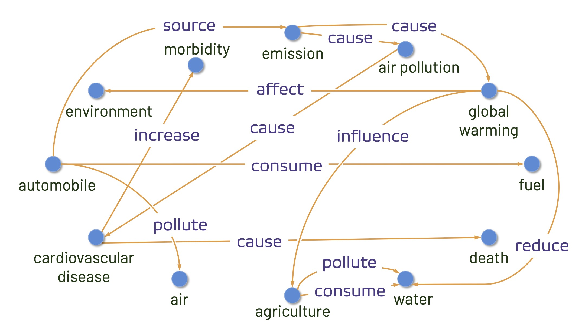

# KnowUREnvironment
 
Despite climate change being one of the greatest threats to humanity, many people are still in denial or lack motivation for appropriate action. A structured source of knowledge can help increase public awareness while also helping crucial natural language understanding tasks such as information retrieval, question answering, and recommendation systems. We introduce <em>KnowUREnvironment</em> -- a knowledge graph for climate change and related environmental issues, extracted from the scientific literature. We automatically identify 210,230 domain-specific entities/concepts and encode how these concepts are interrelated with 411,860 RDF triples backed up with evidence from the literature, without using any supervision or human intervention. Human evaluation shows our extracted triples are syntactically and factually correct (81.69% syntactic correctness and 75.85% precision). The proposed framework can be easily extended to any domain that can benefit from such a knowledge graph.

## Climate Change Abstracts

We extracted 228,860 abstracts related to climate change and environmental issues, by mining articles published before 2020. The following keywords were matched against author provided keywords to find the relevant articles:

<ul>
<li>climate change</li>
<li>sustainability</li>
<li>pollution</li>
<li>global warming</li>
<li>sea-level rise</li>
<li>climate</li>
<li>water stress</li>
<li>coastal flooding</li>
</ul>

<a href="https://drive.google.com/file/d/1-x-61xCEKWbOyw94ij_GMmpNBeAERS_f/view?usp=sharing"> Download the extracted abstracts with author-provided keywords</a>

## About the Knowledge Graph

KnowUREnvironment includes facts about climate change and related environmental issues in the form of <em>Resource Description Framework (RDF)</em> triples. An RDF triple consists of three components: (i) subject, (ii) predicate, and (iii) object. For example, we can express the fact "automobile emits CO2" can be expressed as ("automobile", "emit", "CO2") where "automobile" is the subject, "CO2" is the object, and "emit" is a directional relationship between the subject and the object. The entire set of the RDF triples can be captured by a directed multigraph (there may be multiple relationships between the same subject-object pair) where the subjects and objects are represented using nodes, and the predicate is represented using a directed, labeled edge in the graph.

<figure>
 
 <figcaption>A snapshot of KnowUREnvironment depicts how "automobile" could be related to climate change and related issues.
Within a few hops, the graph can connect concepts from diverse yet relevant fields like environment, agriculture, and public
health demonstrating how powerful yet so compact a knowledge graph can be.</figcaption>
</figure>

## Accessing the RDF Triples

The RDF triplets extracted by mining academic literature are made <a href="https://github.com/saiful1105020/KnowUREnvironment/blob/main/final_tuples_double_evidence.csv">available</a> in this repository. 

The CSV file contains 6 columns:

<ul>
<li><b>subject</b> of the RDF triple</li>
<li><b>object</b> of the RDF triple</li>
<li><b>relation</b> is the predicate of the RDF triple, a directed relationship from the subject to the object</li>
<li><b>paper_id</b> traces the paper(s) from where the triple was extracted. Please use the uploaded json file in <b>Climate Change Abstracts</b> section to link this paper_id to the corresponding paper. The json file contains a list of 228,860 papers, the first paper in the list is assigned paper_id = 0, and the last paper is assigned paper_id = 228,859.</li>
<li><b>sentence_no</b> traces the exact sentence in the corresponding paper abstract from where the triple is extracted. The corresponding paper_id is index matched with the sentence_no column. For example, if a triple is extracted from multiple papers, the paper_id column can be [17218, 36262] and the sentence_no column can be [3,4] -- the evidence sentences can be found from the 3rd sentence of the abstract of 17218th paper, and the 4th sentence of the abstract of the 36262th paper.</li>
<li><b>num_evidence</b> is the number of different sources the triple was obtained from. More sources typically means the triple can be trusted more. </li>
</ul>

Each triple can be traced back to the sentence of the abstract of a published paper by using the "paper_id", and "sentence_no" column. Please note that the knowledge graph is still ongoing development, and currently made available for information purpose only. 

Another version of the knowledge graph that is less trusted, but more extensive in terms of coverage is also available to <a href="https://github.com/saiful1105020/KnowUREnvironment/blob/main/final_tuples.csv">download</a>. 

Sample code for showing evidence for the triples:

```python
import pandas as pd
import json
import nltk
from nltk.tokenize import sent_tokenize
import numpy as np


with open("all_abstracts_with_keywords.json", encoding='utf-8') as f:
    all_abstracts = json.loads(f.read())

    df = pd.read_csv("final_tuples.csv")
    for i,r in df.iterrows():
        triple = (r['subject'], r['relation'], r['object'])
        evidence = []
        
        papers = np.asarray(r['paper_id'][1:-1].split(","), dtype=int)
        n = len(papers)
        
        for j in range(0,n):
            abstract = sent_tokenize(all_abstracts[papers[j]]['abstract'])
            sentence_nos = np.asarray(r['sentence_no'][1:-1].split(","), dtype=int) 
            sentence = abstract[sentence_nos[j]]
            evidence.append(sentence)
            
        print("+"*20)
        print("Triple: ",end="")
        print(triple)
        print("Evidence sentence: ",end="\n")
        for j in range(0,len(evidence)):
            print("%d. %s"%((j+1),evidence[j]))
        print("-"*20)
        
        break
        
```

## Code for Triplet Extraction

i. Install AMR: 
    Follow the installation instructions of AMR: https://amrlib.readthedocs.io/en/latest/install/ 
    The requirements.txt file (for AMR installation) is here: https://github.com/bjascob/amrlib/blob/master/requirements.txt
    
ii. Install additional packages (e.g., matplotlib, nltk, rapidfuzz). 

Alternatively, the conda environment I worked with is provided as an environment.yml file. You may create an environment with the yml file and then download and place the AMR models as instructed here: https://amrlib.readthedocs.io/en/latest/install/

**ClimateKB.ipynb** provides a more detailed documentation of the methodology, and can be used for extracting the triplets.

**Visualization.ipynb** visualizes a part of the knowledge graph (hand-picked) as a directed graph.
 
## Citation

If you are using any of the materials from this repository, please make sure to cite the following article:

```js
@article{islam2022know,
  title={KnowUREnvironment: An Automated Knowledge Graph for Climate Change and Environmental Issues},
  author={Islam, Md Saiful and Proma, Adiba and Zhou, Yilin and Akter, Syeda Nahida and Wohn, Caleb and Hoque, Ehsan},
  booktitle={2022 AAAI Fall Symposium Series},
  year={2022}  
}
```
